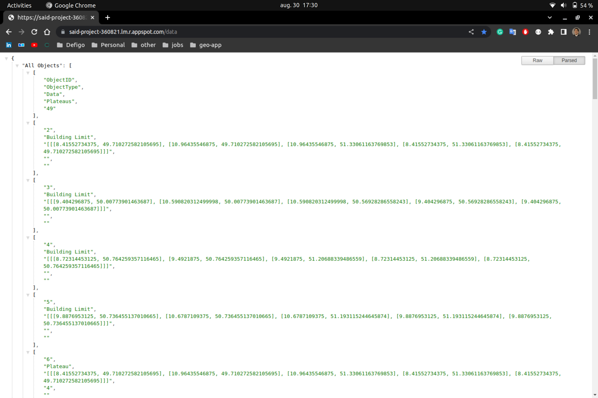
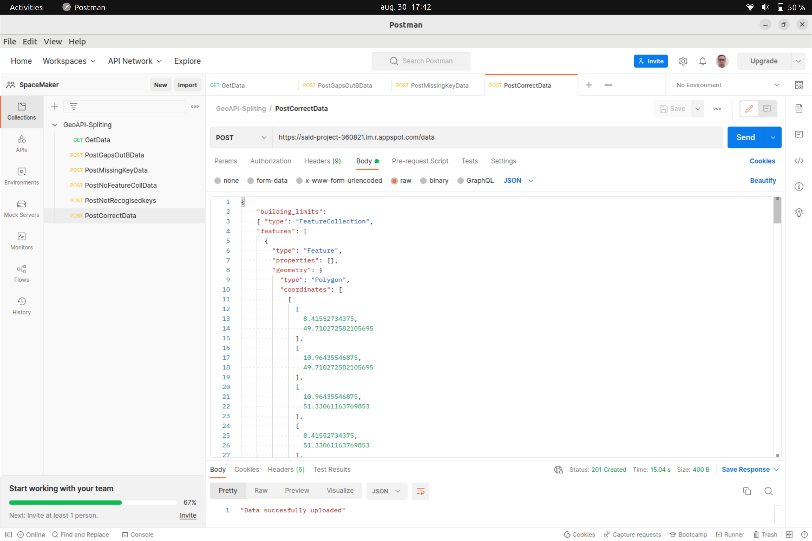
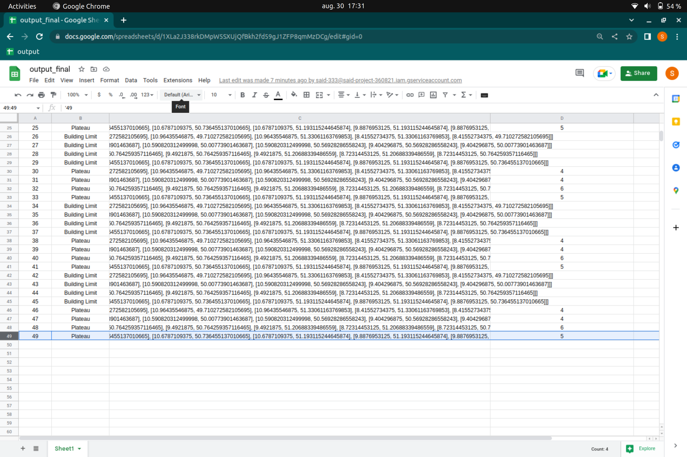
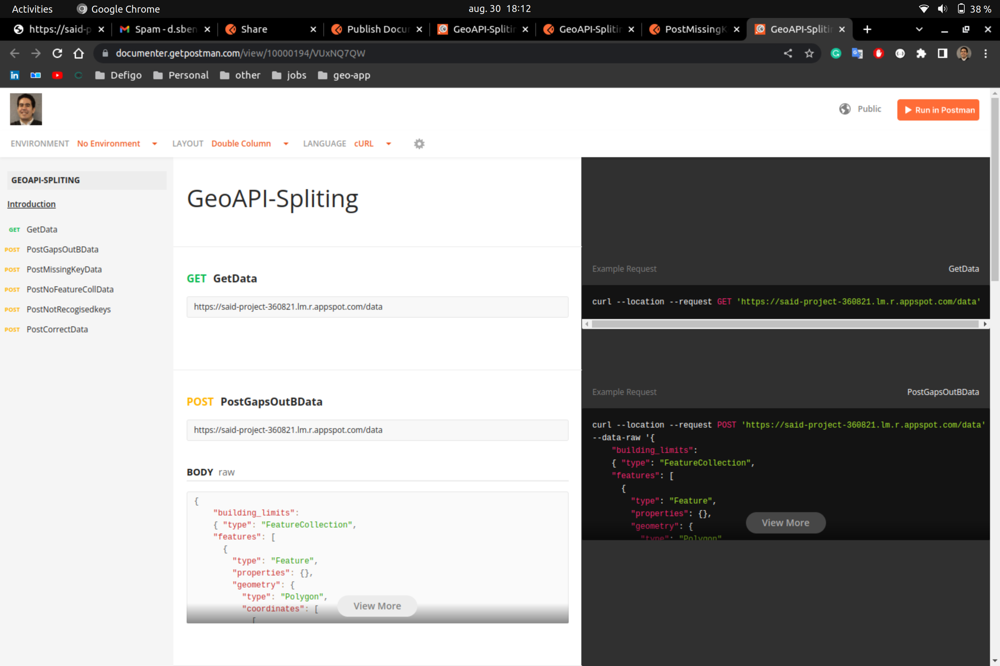

# BuildingSplits-API

* Description:
Implementation of a programmatic API with a clean interface that consumes building limits and height plateaus split up the building limits according to the height plateaus, and stores these three entities (building limits, height plateaus and split building limits) in a persistent way.

* Python choice:
  We have used Python as a programming language because it contains libraries for calculation and backend APIs (Flask framework) and it is now one of the most commonly used programming languages in the world.

* Runtime environment:

    ```
    mkdir geo_app # Create project directory.
    python3 -m venv ./geo_app_env # Create Python3 env-variable.
    source ./geo_app_env/bin/activate # Activat env-variable.
    cd geo_app # Go to Project folder
    code . # Open project directory using vscode
    ```

  * Create `requirements.txt` file that contains all dependencies libraries

    ```bash
    pip3 install pipreqs
    pip3 install pip-tools
    pip3 freeze > requirements.txt
    ```

    * install project dependencies:

        ```bash
        pip3 install -r requirements.txt
        ```
  
* Connection - Google Sheet API

    The first part of the code in the document establishes a connection to the google sheets API and opens the worksheet as **wks**.

    ```python
    scope = ['https://spreadsheets.google.com/feeds','https://www.googleapis.com/auth/drive']
    sa = gspread.service_account('credentials.json', scope)
    sh = sa.open("output_final")
    wks = sh.worksheet("Sheet1")
    ```

* Data configuration - `CreateColName` method
  
  The method updates the specified values in google sheets and inserts the names of the columns.
  
    ```python
    def createColNames():
        wks.update('A1','ObjectID')
        wks.update('B1','ObjectType')
        wks.update('C1','Data')
        wks.update('D1','Plateaus')
    ```

* API - endpoint handling
  
  The class `api_requests`, contains handles the API endpoint for the application. When the user calls the API with a get request, all data from the google worksheet is returned in a JSON format When a post request is called, the input of the post body is stored and then forwarded to the `newInput` method.

    ```python
    class api_requests(Resource):
        # Get all data splited
        def get(self):
            data = wks.get_all_values()
            return {'All Objects': data}, 200

        # POST - data (BuildingLimits and Heigth plateaus) and return splited data. post request to upload new data to specific row in spreadsheet.

        def post(self):
            parser = reqparse.RequestParser()
            arguments = request.data
            reply = newInput(json.loads(arguments))
            return reply,    
            

    # API - /data endpoints to expose data
    api.add_resource(api_requests, '/data')
      ```

* API - endpoint error handling
  
  The `newInput(data)` function first calls the `checkInput` function whose task it is to check if the input is valid using `checkInput(data)` method that will be described in the next section.

    ```python
    def newInput(data):
        result = checkInput(data)

        # Error Handling - APIs spliting 
        if result == 1:
            return 'Key(s) Missing! Building limit or height Plateau key is missing'
        elif result == 2:
            return 'The input Type is required to be a Feature Collection'
        elif result == 3:
            return 'The quantity of items in building limits is not equal to the one of height plateau'
        elif result == 4:
            return 'The total area of the building limits is not equal to the total area of the height plateaus'
        elif result ==5:
            return 'There are gaps between building limits or height plateaus outisde of building limits'
        elif result == 0:
            createLimits(data)
            createPlateaus(data)
            return 'Data succesfully uploaded'
        return result
    ```

* API Input Data validation check

  Now we will get to the different parts of the `checkInput` function. This first for loop checks if the keys ‘building limits’ as well as ‘height plateaus’ exist in the data that has been input.

```python
    # Verifies provided Data - makes sure that building limits and height plateaus as well as the indidvidual object type is 'polygon'
    def checkInput(data):
        build_temp = []
        height_temp = []
        build_area = 0
        height_area = 0
        
        valid = 0

        # This first for loop checks if the keys ‘building limits’ as well as ‘height plateaus’ exist in the data that has been input.
        for item in data.keys():
            if item != 'building_limits' and item != 'height_plateaus':
                # Checks if 'building limits' and 'height_plateaus' exist
                valid = 1
                break
            else:
                valid = 0


        if valid == 0:
            if data['building_limits']['type'] == 'FeatureCollection' and data['height_plateaus']['type'] == 'FeatureCollection':
                # Checks if both inputs are feature collections
                pass
            else:
                valid = 2
                
            buildLen = len(data['building_limits']['features'])
            heightLen = len(data['height_plateaus']['features'])
            if buildLen != heightLen:
                # Checks if height_plateaus and building_limits have the same amount of data points
                valid = 3
            else:
            # Calculates total area of height plateaus and building limits and checks if they are equal.
                for items in data['building_limits']['features']:
                    for items2 in items['geometry']['coordinates']:
                        for items3 in items2:
                            build_area = build_area + (items3[0] + items3[1])
                            build_temp.append(items3[0])
                            build_temp.append(items3[1])
        
                for items in data['height_plateaus']['features']:
                    for items2 in items['geometry']['coordinates']:
                        for items3 in items2:
                            height_area = height_area + (items3[0] + items3[1])
                            height_temp.append(items3[0])
                            height_temp.append(items3[1])
            if height_area != build_area:
            # Checks of building limit area matches height plateau area.     
                valid = 4
        
            elif height_area == build_area:
                # Checks for gaps or building limit exceedings.
                if not np.array_equal(build_temp,height_temp):
                    valid = 5
            

        return valid

```

The next part of the code checks if the type of the input is a collection of features for both, building limits and height plateaus.

```python
    # This part of the code checks if the type of the input is a collection of features for both, building limits and height plateaus
    if valid == 0:
        if data['building_limits']['type'] == 'FeatureCollection' and data['height_plateaus']['type'] == 'FeatureCollection':
            # Checks if both inputs are feature collections
            pass
        else:
            valid = 2
```

The next part retrieves all individual coordinates and stores them in a temporary array. In the end, the sum is calculated and compared between height plateaus and building limit.

```python
        # The next part retrieves all individual coordinates and stores them in a temporary array. At the end the sum is calculated and compared between height plateaus and building limit. 
        # (calculates total area of height plateaus and building limits and checks if they are equal)
            for items in data['building_limits']['features']:
                for items2 in items['geometry']['coordinates']:
                    for items3 in items2:
                        build_area = build_area + (items3[0] + items3[1])
                        build_temp.append(items3[0])
                        build_temp.append(items3[1])
       
            for items in data['height_plateaus']['features']:
                for items2 in items['geometry']['coordinates']:
                    for items3 in items2:
                        height_area = height_area + (items3[0] + items3[1])
                        height_temp.append(items3[0])
                        height_temp.append(items3[1])
        if height_area != build_area:
        # Checks of building limit area matches height plateau area         
            valid = 4
```

The following method checks for gaps by comparing the values within the 2 coordinate arrays.

```python
# This following method checks for gaps by comparing the values within the 2 coordinate arrays. 
        elif height_area == build_area:
            # Checks for gaps or building limit exceedings
            if not np.array_equal(build_temp,height_temp):
                valid = 5
```

The result of `valid` is then returned to ‚newInput‘ and interpreted accordingly to the value it returned. Based on this the JSON data is then either uploaded or an error is returned to the user

```python
        # Error Handling - APIs spliting 
        if result == 1:
            return 'Key(s) Missing! Building limit or height Plateau key is missing'
        elif result == 2:
            return 'The input Type is required to be a Feature Collection'
        elif result == 3:
            return 'The quantity of items in building limits is not equal to the one of height plateau'
        elif result == 4:
            return 'The total area of the building limits is not equal to the total area of the height plateaus'
        elif result ==5:
            return 'There are gaps between building limits or height plateaus outisde of building limits'
        elif result == 0:
            createLimits(data)
            createPlateaus(data)
            return 'Data succesfully uploaded'
        return result
```

We then have two methods that extract all building limits as well as all height plateaus. At the end of this function, a new object is created.

```python

# Extracts data from json and creates NewPlateauObject if exist on Google Sheet
def createPlateaus(data):
     plateauToImport =data['height_plateaus']['features']
     lenPlateauToImport =len(data['height_plateaus']['features'])
     for items in range(lenPlateauToImport):
        id = increaseID()
        plateaus = getPlateaus(data)
        plateaus = plateaus[items]
        plateauData = plateauToImport[items]['geometry']['coordinates']
        NewPlateauObject(str(plateaus),str(plateauData),str(id))

# Extracts data from json and creates NewLimitObject on Google Sheet
def createLimits(data):
    limitsToImport =data['building_limits']['features']
    lenBuildingToImport =len(data['building_limits']['features'])
    for items in range(lenBuildingToImport):
        id = increaseID()
        limitData = limitsToImport[items]['geometry']['coordinates']
        NewLimitObject(str(limitData),str(id))
```

With the object creation, the data is written to the google sheet

```python
# Creates new limit line on google sheet
class NewLimitObject:
 
    def __init__(self,data,id):
        self.id = id
        self.data = data
        # Uploads values to google sheet
        wks.update('A'+ id, id)
        wks.update('B'+ id, 'Building Limit')
        wks.update('C'+ id, data)

# Creates new plateau line on google sheet
class NewPlateauObject:

    def __init__(self,plateau,plateauData,id):
        self.id = id
        self.data = data
        #uploads values to google sheet
        wks.update('A'+ id, id)
        wks.update('B'+ id, 'Plateau')
        wks.update('C'+ id, plateauData)
        wks.update('D'+ id, plateau)
```

The last function which is specific to the height plateaus extracts the `elevation` element from the height plateau ‘elevation’ property on the input JSON data file.

```python
def getPlateaus(data):
    elevations = []
    for i in range(len(data['height_plateaus']['features'])):
            x = data['height_plateaus']['features'][i]['properties']['elevation']
            elevations.append(x)
    return elevations
```

* API Deployment GCP Cloud
  
  Creates a Dockerfile with the name Dockerfile and the following lines of code to it.

    ```Dockerfile
        FROM python:3

        WORKDIR /usr/src/app

        COPY requirements.txt ./
        RUN pip install --no-cache-dir -r requirements.txt

        COPY . .

        CMD [ "python", "./app.py" ]
    ```

Now your project is ready to be deployed. To deploy it to Google Cloud Run, we need to containerize the project and the container to Google Container Registry (gcr).

Let’s see how it can be done.

* Go to your project directory and open up the terminal.
* Type gcloud init and select the GCP project in which you want to deploy and note the project id.
* Type export project_id=THE_PROJECT_ID_NOTED (project-360821).
* Type gcloud builds submit –tag gcr.io/${project_id}/geo_app:v1. (This will take a few minutes to complete.)
* Type gcloud run deploy –image gcr.io/${project_id}/geo_app:v1 –platform managed
* You will be prompted for the service name: press ENTER to accept the default name, geo_app.
* You will be prompted for region: select the region of your choice.
* You will be prompted to allow unauthenticated invocations: respond y
* Then wait for a few moments until the deployment is complete. On success, the command line displays the service URL `https://said-project-360821.lm.r.appspot.com/`.

* API Test - Postman

Visit your deployed container by opening the service `URL=https://said-project-360821.lm.r.appspot.com/data` in a web browser by adding the path `/data` you will get data from Google Sheet via the API deployed:

* Get All Data splited - via API deployed
  


* POST Data and saved on Gsheet- via API deployed - tested via postman
  


* Save all data splited



* Postman API testing
  Documentation via postman if you want to develop an application that will consume our API service:
API testing documentation and also different language code (js, py, java..). You can test the API via the url below:

    <https://documenter.getpostman.com/view/10000194/VUxNQ7QW>


